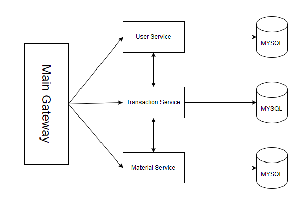

<h1>DOCUMENTATION TAKE HOME TEST BADR-INTERACTIVE API GATEWAY MICROSERVICE</h1>

[circleci-image]: https://miro.medium.com/v2/resize:fit:1400/1*i2fRBk3GsYLeUk_Rh7AzHw.png
[circleci-url]: https://circleci.com/gh/nestjs/nest

<p align="center">
    
</p>

## TECH STACK

<h3 align="left">Languages and Tools:</h3>
<h2 align="left"> <a href="https://www.javascript.com/" target="_blank" rel="noreferrer">  </a> <a href="https://nodejs.org" target="_blank" rel="noreferrer">  </a> <a href="https://www.mysql.com/" target="_blank" rel="noreferrer">  </a> <a href="https://sequelize.org/" target="_blank" rel="noreferrer">  </a>

## Introduction
Project ini di buat oleh <b>Muhammad Ridho Hansyah</b> sebagai salah satu test untuk proses rekruitment di Badr Interactive

## DATA DIRI


<table>
  <thead>
    <tr>
      <th>NAMA</th>
      <th>EMAIL</th>
    </tr>
  </thead>
  <tbody>
    <tr>
      <td><h2>MUHAMMAD RIDHO HANSYAH</h2></td>
      <td><h2>hansyahridho815@gmail.com</h2></td>
    </tr>
  </tbody>
</table>

## Architecture Microservice API Gateway


Dalam pembuatan take home test ini memberlakukan konsep microservice. Untuk komunikasi antar service menggunakan Restful API dengan dibuatkan 1 API Gateway sebagai perantara untuk user dapat menggunaka service yang ada. Pada tiap service memiliki route masing - masing serta memiliki database mereka masing - masing.


## Project Features
### Service user:
Pada service user tempat untu manage akun tiap user, fiture yang ada pada serice user yaitu: 
* Register & login user
* Get data user
* Update data user
* Delete data user

Selain itu user pada service ini terbagi menjadi dua role yaitu role <b>USER</b> dan <b>ADMIN</b> yang memiliki perbedaan akses pada tiap API.  

### Service material:
Pada service material terdapat dua service utama yaitu service untuk manage material dan service untuk manage vendor. Feature yang tersedia pada service ini yaitu:
* Material service
    1. Create material [2]
    2. Read satu data material [1][2]
    3. Read seluruh data material dengan pagination [1][2]
    4. Update data material [2]
    5. Delete data material [2]
* Vendor service
    1. Create vendor [2]
    2. Read satu data vendor [1][2]
    3. Read seluruh data vendor dengan pagination [1][2]
    4. Update data vendor [2]
    5. Delete data vendor [2]

### Service transaction:
Pada service transaction ini adalah proses transaksi pada sistem berlangsung. Feature yang ada di dalamnya:
1. Create transaction [1]
2. Read satu data transaction [1][2] 
3. Read history transaction dengan pagination [1][2]
4. Update data transaction [2]
5. Delete data transaction [2]

### *PENJELASAN:
- [1] = Bisa di akses role <b>USER</b>
- [2] = Bisa di akses role <b>ADMIN</b>

## ENV
ENV file pada  tiap  service yaitu:

### Service User
<table>
<thead>
  <tr>
    <th>No</th>
    <th>Name</th>
    <th>Value</th>
    <th>Description</th>
  </tr>
</thead>
<tbody>
  <tr>
    <td>1</td>
    <td>ENV</td>
    <td>development</td>
    <td>Environment yang sedang berjalan</td>
  </tr>
  <tr>
    <td>2</td>
    <td>PORT</td>
    <td>3000</td>
    <td>Module run di port</td>
  </tr>
  <tr>
    <td>3</td>
    <td>DB_USERNAME</td>
    <td>root</td>
    <td>Username saat mengakses database</td>
  </tr>
  <tr>
    <td>4</td>
    <td>DB_PASSWORD</td>
    <td>root</td>
    <td>Password saat mengakses database</td>
  </tr>
  <tr>
    <td>5</td>
    <td>DB_NAME</td>
    <td>root</td>
    <td>Nama dari database</td>
  </tr>
  <tr>
    <td>6</td>
    <td>DB_PASSWORD</td>
    <td>root</td>
    <td>Password saat mengakses database</td>
  </tr>
  <tr>
    <td>7</td>
    <td>DB_HOST</td>
    <td>root</td>
    <td>Host saat mengakses database</td>
  </tr>
  <tr>
    <td>8</td>
    <td>SECRET_JWT</td>
    <td>narutoooo</td>
    <td>Secret untuk encrypt dan verify jsonwebtoken</td>
  </tr>
</tbody>
</table>

### Service Material
<table>
<thead>
  <tr>
    <th>No</th>
    <th>Name</th>
    <th>Value</th>
    <th>Description</th>
  </tr>
</thead>
<tbody>
  <tr>
    <td>1</td>
    <td>ENV</td>
    <td>development</td>
    <td>Environment yang sedang berjalan</td>
  </tr>
  <tr>
    <td>2</td>
    <td>PORT</td>
    <td>3001</td>
    <td>Module run di port</td>
  </tr>
  <tr>
    <td>3</td>
    <td>DB_USERNAME</td>
    <td>root</td>
    <td>Username saat mengakses database</td>
  </tr>
  <tr>
    <td>4</td>
    <td>DB_PASSWORD</td>
    <td>root</td>
    <td>Password saat mengakses database</td>
  </tr>
  <tr>
    <td>5</td>
    <td>DB_NAME</td>
    <td>root</td>
    <td>Nama dari database</td>
  </tr>
  <tr>
    <td>6</td>
    <td>DB_PASSWORD</td>
    <td>root</td>
    <td>Password saat mengakses database</td>
  </tr>
  <tr>
    <td>7</td>
    <td>DB_HOST</td>
    <td>root</td>
    <td>Host saat mengakses database</td>
  </tr>
  <tr>
    <td>8</td>
    <td>URL_USER_SERVICE</td>
    <td>http://localhost:3000</td>
    <td>Url untuk komunikasi antar service user</td>
  </tr>
</tbody>
</table>

### Service Transaction
<table>
<thead>
  <tr>
    <th>No</th>
    <th>Name</th>
    <th>Value</th>
    <th>Description</th>
  </tr>
</thead>
<tbody>
  <tr>
    <td>1</td>
    <td>ENV</td>
    <td>development</td>
    <td>Environment yang sedang berjalan</td>
  </tr>
  <tr>
    <td>2</td>
    <td>PORT</td>
    <td>3002</td>
    <td>Module run di port</td>
  </tr>
  <tr>
    <td>3</td>
    <td>DB_USERNAME</td>
    <td>root</td>
    <td>Username saat mengakses database</td>
  </tr>
  <tr>
    <td>4</td>
    <td>DB_PASSWORD</td>
    <td>root</td>
    <td>Password saat mengakses database</td>
  </tr>
  <tr>
    <td>5</td>
    <td>DB_NAME</td>
    <td>root</td>
    <td>Nama dari database</td>
  </tr>
  <tr>
    <td>6</td>
    <td>DB_PASSWORD</td>
    <td>root</td>
    <td>Password saat mengakses database</td>
  </tr>
  <tr>
    <td>7</td>
    <td>DB_HOST</td>
    <td>root</td>
    <td>Host saat mengakses database</td>
  </tr>
  <tr>
    <td>8</td>
    <td>URL_USER_SERVICE</td>
    <td>http://localhost:3000</td>
    <td>Url untuk komunikasi antar service user</td>
  </tr>
  <tr>
    <td>9</td>
    <td>URL_MATERIAL_SERVICE</td>
    <td>http://localhost:3001</td>
    <td>Url untuk komunikasi antar service material</td>
  </tr>
</tbody>
</table>

### Service Main Gateway/API Gateway
<table>
<thead>
  <tr>
    <th>No</th>
    <th>Name</th>
    <th>Value</th>
    <th>Description</th>
  </tr>
</thead>
<tbody>
  <tr>
    <td>1</td>
    <td>PORT</td>
    <td>3002</td>
    <td>Module run di port</td>
  </tr>
  <tr>
    <td>2</td>
    <td>URL_USER_SERVICE</td>
    <td>http://localhost:3000</td>
    <td>Url untuk komunikasi antar service user</td>
  </tr>
  <tr>
    <td>3</td>
    <td>URL_MATERIAL_SERVICE</td>
    <td>http://localhost:3001</td>
    <td>Url untuk komunikasi antar service material</td>
  </tr>
  <tr>
    <td>4</td>
    <td>URL_TRANSACTION_SERVICE</td>
    <td>http://localhost:3002</td>
    <td>Url untuk komunikasi antar service transaction</td>
  </tr>
</tbody>
</table>

## Installation Guide
* Clone repository [assignment](https://github.com/hansyahridho07/fastify-typescript-prisma.git).
* Masuk ke setiap folder satu persatu lalu lakukan
* Run `npm install` untuk install semua dependencies
* Buat file `.env` di tiap root folder pada tiap service
* Run `npm run migration` untuk migration tiap table di tiap service
* Run `npm run seeding` untuk seeding data pada service/folder user dan material
* Run `npm run dev` di tiap service/folder untuk bisa digunakan

> [!CAUTION]
> Run semua service agar tiap feature bisa digunakan. Dan pastikan untuk hit API di service Main Gateway

## API Endpoints

API Endpoints yang tertera di bawah adalah endpoint API pada service API Gateway:

### Service User

| HTTP Verbs | Endpoints | Action |
| --- | --- | --- |
| POST | /v1/api/user/register | Daftar akun user |
| POST | /v1/api/user/login | Login user untuk mendapat access_token |
| GET | /v1/api/user | Mendapat detail akun user |
| PUT | /v1/api/user/ | Update data akun user |
| DELETE | /v1/api/user | Delete data akun user |

### Service Material (Vendor)

| HTTP Verbs | Endpoints | Action |
| --- | --- | --- |
| POST | /v1/api/vendor | Menambahkan data vendor baru |
| GET | /v1/api/vendor/all | Mengambil seluruh vendor yang ada |
| GET | /v1/api/vendor | Mendapat detail data vendor |
| PUT | /v1/api/vendor/:vendor_id | Update data vendor |
| DELETE | /v1/api/vendor/:vendor_id | Delete data vendor |

### Service Material (Material)

| HTTP Verbs | Endpoints | Action |
| --- | --- | --- |
| POST | /v1/api/material | Menambahkan data material baru |
| GET | /v1/api/material/all | Mengambil seluruh material yang ada |
| GET | /v1/api/material | Mendapat detail data material |
| PUT | /v1/api/material/:material_id | Update data material |
| DELETE | /v1/api/material/:material_id | Delete data material |

### Service Transaction

| HTTP Verbs | Endpoints | Action |
| --- | --- | --- |
| POST | /v1/api/transaction | Menambahkan data transaction baru |
| GET | /v1/api/transaction/history | Mengambil seluruh transaction yang ada |
| GET | /v1/api/transaction | Mendapat detail data transaction |
| PUT | /v1/api/transaction/ | Update status transaction |
| DELETE | /v1/api/transaction/:transaction_id | Delete data transaction |

## API LIST

### BASE URL: http://localhost:3003 (API Gateway)

### SERVICE USER

#### 1. REGISTER
#### POST /v1/api/user/register

#### Request:
```json
{
  "name": "John Doe",
  "username": "username",
  "password": "password"
}
```

#### Response:
```json
{
  "success": true,
  "statusCode": 201,
  "message": "success create user",
  "data": null
}
```


### 2. Login
### POST /v1/api/user/login

#### Request:
```json
{
  "username": "email@gmail.com",
  "password": "password"
}
```

#### Response:
```json
{
  "success": true,
  "statusCode": 200,
  "message": "success login",
  "data": {
    "type": "Bearer",
    "access_token": "eyJhbGciOiJI",
    "expired_in": 900000 //milisecond
  }
}
```

### 3. Get Info User
### GET /v1/api/user

#### Headers:
```json
{
    "Authorization": "Bearer "
}
```

#### Response:
```json
{
  "success": true,
  "statusCode": 200,
  "message": "success get data user",
  "data": {
    "id": 4,
    "name": "John Doe",
    "username": "username01",
    "role": "USER"
  }
}
```

### 4. Update data user
### PUT /v1/api/user

#### Headers:
```json
{
  "Authorization": "Bearer "
}
```

#### Request: 
```json
{
  "name": "John Doe", //optional
  "username": "username02", //optional
  "password": "password01" //optional
}
```

#### Response:
```json
{
  "success": true,
  "statusCode": 200,
  "message": "success update data user",
  "data": null
}
```

### 5. Delete Account User
### DELETE /v1/api/user

#### Headers:
```json
{
  "Authorization": "Bearer "
}
```

#### Response:
```json
{
  "success": true,
  "statusCode": 200,
  "message": "success delete user",
  "data": null
}
```

### SERVICE MATERIAL (VENDOR)

### 1. Create data vendor
### POST /v1/api/vendor

#### Headers:
```json
{
  "Authorization": "Bearer " // hanya admin yang bisa membuat vendor
}
```

#### Request:
```json
{
  "name": "PT Maju Mundur",
  "address": "Makassar"
}
```

#### Response:
```json
{
  "success": true,
  "statusCode": 201,
  "message": "success create vendor",
  "data": null
}
```


### 2. Get all list vendor
### GET /v1/api/vendor/all

#### Headers:
```json
{
  "Authorization": "Bearer "
}
```

#### Request (URL Param)
```
- page => mandatory(ex: 1)
- size = mandatory(ex: 10) // jumlah data yang mau di ambil dari database
```

#### Response:
```json
{
  "success": true,
  "statusCode": 200,
  "message": "success get many data vendor",
  "data": {
    "docs": [
      {
        "id": 2,
        "name": "CV Jaya Abadi",
        "address": "Bandung",
        "materials": [
          {
            "id": 3,
            "material_name": "Bata",
            "stock": 100
          },
          {
            "id": 4,
            "material_name": "Semen",
            "stock": 100
          }
        ]
      },
      {
        "id": 1,
        "name": "PT Angkasa Jaya",
        "address": "Jakarta",
        "materials": [
          {
            "id": 1,
            "material_name": "Pasir",
            "stock": 100
          },
          {
            "id": 2,
            "material_name": "Batako",
            "stock": 100
          }
        ]
      }
    ],
    "page": 1,
    "totalPage": 1,
    "total": 3
  }
}
```

### 3. Find one data vendor
### GET /v1/api/vendor

#### Headers:
```json
{
  "Authorization": "Bearer "
}
```

#### Request (URL Param)
```
- vendor_id => mandatory(ex: 1)
```

#### Response:
```json
{
  "success": true,
  "statusCode": 200,
  "message": "success get data vendor",
  "data": {
    "id": 1,
    "name": "PT Angkasa Jaya",
    "address": "Jakarta"
  }
}
```

### 4. Update data vendor
### PUT /api/v1/transaction/:vendor_id

#### Headers:
```json
{
  "Authorization": "Bearer " // hanya admin yang bisa update data vendor
}
```

#### Request:
```json
{
  "name": "PT Perkasa Nusantara 2", //optional
  "address": "Yogyakarta 1" //optional
}
```

#### Response:
```json
{
  "success": true,
  "statusCode": 200,
  "message": "success update vendor",
  "data": null
}
```

### 5. Delete data vendor
### DELETE /v1/api/vendor/:vendor_id

#### Headers:
```json
{
  "Authorization": "Bearer " // hanya admin yang bisa delete data vendor
}
```

#### Response:
```json
{
  "success": true,
  "statusCode": 200,
  "message": "success delete vendor",
  "data": null
}
```

### SERVICE MATERIAL (MATERIAL)

### 1. Create data material
### POST /v1/api/material

#### Headers:
```json
{
  "Authorization": "Bearer " // hanya admin yang bisa create data material
}
```

#### Request:
```json
{
  "material_name": "Payung",
  "vendor_id": 1,
  "stock": 20,
  "status": "AVAILABLE"
}
```

#### Response:
```json
{
  "success": true,
  "statusCode": 201,
  "message": "success create material",
  "data": null
}
```

### 2. Get all list material
### GET /v1/api/material/all

#### Headers:
```json
{
  "Authorization": "Bearer "
}
```

#### Request (URL Param)
```
- page => mandatory(ex: 1)
- size => mandatory(ex: 10) // jumlah data yang mau di ambil dari database
- material_name => optional(ex: "bata")
- vendor_id => optional(ex: 1)
- status => optional(ex: "AVAILABLE") // enum("AVAILABLE","EMPTY")
```

#### Response:
```json
{
  "success": true,
  "statusCode": 200,
  "message": "success get materials",
  "data": {
    "docs": [
      {
        "id": 6,
        "material_name": "Payung",
        "stock": 20,
        "status": "AVAILABLE",
        "vendor": {
          "id": 1,
          "name": "PT Angkasa Jaya",
          "address": "Jakarta"
        }
      },
      {
        "id": 4,
        "material_name": "Semen",
        "stock": 100,
        "status": "EMPTY",
        "vendor": {
          "id": 2,
          "name": "CV Jaya Abadi",
          "address": "Bandung"
        }
      }
    ],
    "page": 1,
    "totalPage": 1,
    "total": 5
  }
}
```

### 3. Find one data material
### GET /v1/api/material

#### Headers:
```json
{
  "Authorization": "Bearer "
}
```

#### Request (URL Param)
```
- material_id => mandatory(ex: 3)
```

#### Response:
```json
{
  "success": true,
  "statusCode": 200,
  "message": "success get material",
  "data": {
    "id": 6,
    "material_name": "Payung",
    "stock": 20,
    "status": "AVAILABLE",
    "vendor": {
      "id": 1,
      "name": "PT Angkasa Jaya",
      "address": "Jakarta"
    }
  }
}
```

### 4. Update data material
### PUT /api/v1/material/:material_id

#### Headers:
```json
{
  "Authorization": "Bearer " // hanya admin yang bisa update data vendor
}
```

#### Request:
```json
{
  "material_name": "Payung Hujan", //optional
  "vendor_id": 2, //optional
  "stock": 68, //optional
  "status": "EMPTY" //optional
}
```

#### Response:
```json
{
  "success": true,
  "statusCode": 200,
  "message": "success update material",
  "data": null
}
```

### 5. Delete data material
### DELETE /v1/api/material/:material_id

#### Headers:
```json
{
  "Authorization": "Bearer " // hanya admin yang bisa delete data vendor
}
```

#### Response:
```json
{
  "success": true,
  "statusCode": 200,
  "message": "success delete material",
  "data": null
}
```

### SERVICE TRANSACTION

### 1. Create data transaction
### POST /v1/api/transaction

#### Headers:
```json
{
  "Authorization": "Bearer " // hanya user yang bisa create data transaction
}
```

#### Request:
```json
{
  "material_id": 4,
  "amount": 1,
  "reff_id": "TRX006"
}
```

#### Response:
```json
{
  "success": true,
  "statusCode": 201,
  "message": "success create transaction",
  "data": null
}
```

### 2. Get all list transaction
### GET /v1/api/transaction/history

#### Headers:
```json
{
  "Authorization": "Bearer "
}
```

#### Request (URL Param)
```
- page => mandatory(ex: 1)
- size => mandatory(ex: 10) // jumlah data yang mau di ambil dari database
- material_name => optional(ex: "bata")
- vendor_name => optional(ex: "PT Jaya Abadi")
- material_name => optional(ex: "Paku")
- customer_name => optional(ex: "Ridho") //ini biasanya di pakai oleh admin
- transaction_id => optional(ex: 10)
- reff_id => optional(ex: "TRX006")
- status => optional(ex: "SUCCESS") // enum("PENDING","SUCCESS","FAILED")
```

#### Response:
```json
{
  "success": true,
  "statusCode": 200,
  "message": "success get data materials",
  "data": {
    "docs": [
      {
        "id": 5,
        "customer": {
          "id": 2,
          "name": "ridho hansyah"
        },
        "vendor": {
          "id": 2,
          "name": "CV Jaya Abadi",
          "address": "Bandung"
        },
        "material": {
          "id": 4,
          "name": "Semen",
          "amount": 1
        },
        "reff_id": "TRX006",
        "status": "PENDING",
        "createdAt": "2024-06-08T06:49:27.000Z",
        "updatedAt": "2024-06-08T06:49:27.000Z"
      }
    ],
    "page": 1,
    "totalPage": 1,
    "total": 3
  }
}
```

### 3. Find one data transaction
### GET /v1/api/transaction

#### Headers:
```json
{
  "Authorization": "Bearer "
}
```

#### Request (URL Param)
```
- transaction_id => mandatory(ex: 5)
```

#### Response:
```json
{
  "success": true,
  "statusCode": 200,
  "message": "success get transaction",
  "data": {
    "id": 4,
    "customer": {
      "id": 2,
      "name": "ridho hansyah"
    },
    "vendor": {
      "id": 2,
      "name": "CV Jaya Abadi",
      "address": "Bandung"
    },
    "material": {
      "id": 4,
      "name": "Semen",
      "amount": 1
    },
    "reff_id": "TRX005",
    "status": "FAILED",
    "createdAt": "2024-06-08T03:09:12.000Z",
    "updatedAt": "2024-06-08T03:17:13.000Z"
  }
}
```

### 4. Update data transaction
### PUT /api/v1/transaction/

#### Headers:
```json
{
  "Authorization": "Bearer " // hanya admin yang bisa update status transaction
}
```

#### Request:
```json
{
  "transaction_id": 5,
  "status": "FAILED"
}
```

#### Response:
```json
{
  "success": true,
  "statusCode": 200,
  "message": "success update transaction",
  "data": null
}
```

### 5. Delete data transaction
### DELETE /v1/api/transaction/:transaction_id

#### Headers:
```json
{
  "Authorization": "Bearer " // hanya admin yang bisa delete data transaction
}
```

#### Response:
```json
{
  "success": true,
  "statusCode": 200,
  "message": "success delete transaction",
  "data": null
}
```